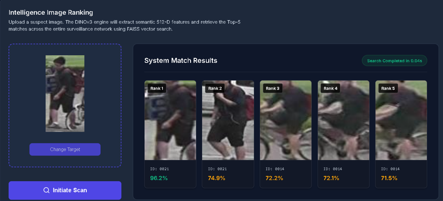
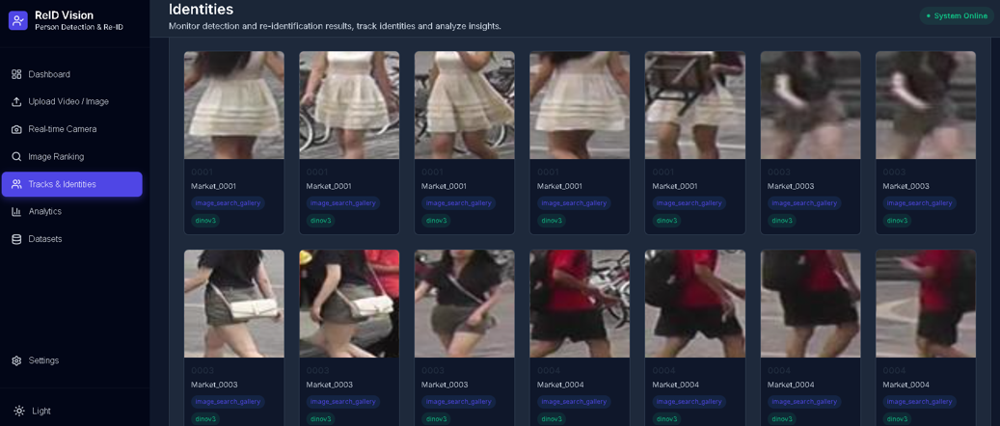
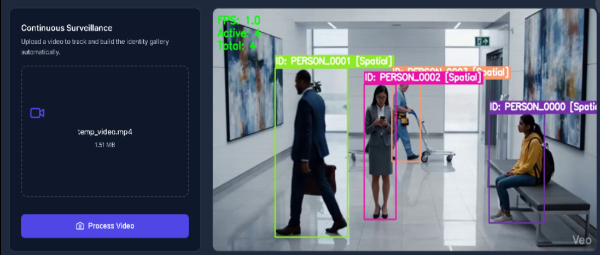
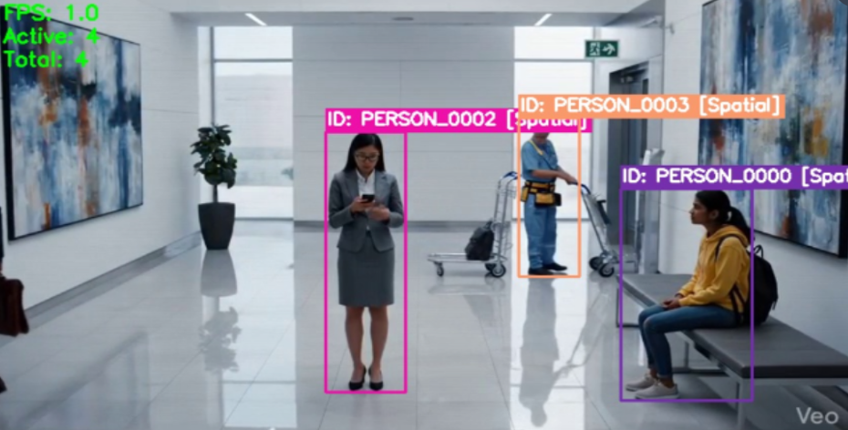
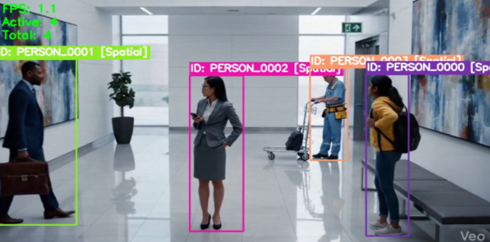
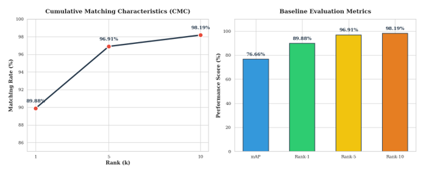
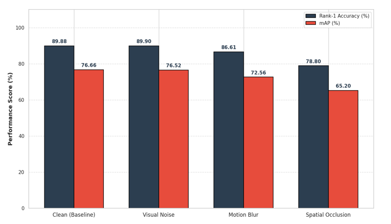

# 👁️ PERCEPTA - Semantic Person Re-Identification System

An AI-powered person re-identification system that performs robust cross-camera identity retrieval using transformer-based feature learning and semantic similarity search. The project integrates object detection, feature extraction, and vector indexing to identify individuals across different surveillance cameras, even under challenging environmental conditions.

---

## ✨ Features

- Real-time pedestrian detection
- Cross-camera person re-identification
- Top-k identity retrieval
- DINOv3 Vision Transformer embeddings
- Circle Loss optimization
- FAISS similarity search
- Dynamic gallery registration
- Interactive web dashboard
- Robust against blur, occlusion, and image noise

---

## 🔄 System Workflow

```
Input Image / Video
        │
        ▼
Object Detection
(YOLOv8 / RT-DETR)
        │
        ▼
Feature Extraction
(DINOv3)
        │
        ▼
512-D Embedding Generation
        │
        ▼
FAISS Gallery Indexing
        │
        ▼
Top-k Identity Retrieval
```

---

## 🛠️ Tech Stack

### 🧠 AI & Machine Learning

- Python
- PyTorch
- OpenCV
- DINOv3
- RT-DETR
- YOLOv8
- Circle Loss
- FAISS

### ⚙️ Backend

- FastAPI

### 🎨 Frontend

- React
- Vite
- JavaScript

---

## 📁 Project Structure

```
PERCEPTA-ReIdentification-System
│
├── ai_service/
│   ├── reid_pipeline.py
│   ├── faiss_tracker.py
│   ├── gallery_manager.py
│   ├── model_loader.py
│   └── utils.py
│
├── backend/
│   ├── main.py
│   ├── config.py
│   ├── generate_tsne.py
│   └── requirements.txt
│
├── frontend/
│   ├── public/
│   └── src/
│
├── docs/
│
└── README.md
```

---

## 📊 Dataset

Market-1501

---

## 📈 Evaluation Metrics

- Rank-1
- Rank-5
- Rank-10
- Mean Average Precision (mAP)
- t-SNE Visualization

---

## 🚀 Installation

Clone the repository

```bash
git clone https://github.com/nihal3000/PERCEPTA-ReIdentification-System.git
```

Move into the project

```bash
cd PERCEPTA-ReIdentification-System
```

Install backend dependencies

```bash
pip install -r backend/requirements.txt
```

Install frontend dependencies

```bash
cd frontend
npm install
```

---

## 🏃‍♂️ Run Backend

```bash
cd backend
python main.py
```

---

## 🏃‍♂️ Run Frontend

```bash
cd frontend
npm run dev
```

---

## 📸 Screenshots

### 🎯 1. Intelligent Image Ranking (Top-5 Retrieval)



### 🗂️ 2. Gallery Management & Identity Dashboard



### 🎥 3. Continuous Video Engine & Dynamic Re-ID







### 📊 4. Performance Metrics (CMC Curve & mAP)



### 🛡️ 5. Robustness against Adversarial Conditions



---

## 🔮 Future Enhancements

- Multi-camera deployment
- Edge AI optimization
- Distributed gallery indexing
- Real-time video analytics
- Larger benchmark support

---

## 📜 License

This project is intended for educational and demonstration purposes.
